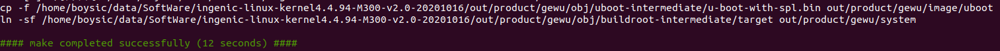
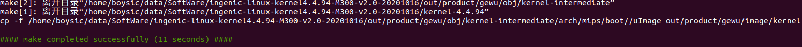
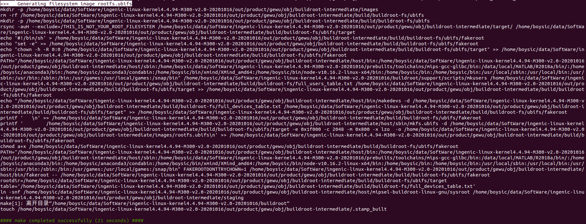
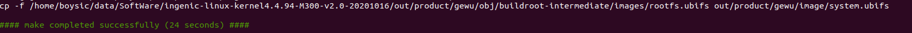

# 快速开发指南

# 1.M300开发板使用方法

## 1.1.代码结构

---
本工程分为如下几个目录，各目录内容如下:

* build : 整个工程的编译规则
* buildroot : buildroot源码，提供基础文件系统
* device : 板级配置信息
* docs : 说明文档和用户手册
* external : Android音频底层调试相关
* packages : 存放buildroot之外需要的相关模块和测试Demo
* prebuilts : 存放烧录工具、编译链
* kernel : kernel源码
* u-boot : uboot源码

## 1.2.如何快速编译

---
* **第一步、导出环境变量**

    ```c
    $ source build/envsetup.sh
    ```

* **第二步、选择device**

    选择设备，例如gewu_v1.0；同时选择存储类型，例如mmc,emmc和nand。可通过执行以下命令进行选择：

    ```c
    $ lunch
    ```

* **第三步、编译image**
  * 以gewu.v10_nand_4.4.94-eng为例，编译整个工程方法如下
  * 在工程目录下执行make或make MAKE_JLEVEL=8或make -j8（多线程编译)
  
    ```c
    $ make -j8
    ```

  * 编译完成后在out/product/gewu/image/目录下生成kernel，system.ubifs，uboot镜像。
  
    ```c
    $ ls out/product/gewu/image/
      kernel  system.ubifs  uboot
    ```

* **可选: OTA编译image**
  * 以gewu.v10_nand_4.4.94_ota-eng为例，编译整个工程方法如下
  
  * 在工程目录下执行make或make MAKE_JLEVEL=8或make -j8（多线程编译)
  
    ```c
    $ make -j8
    ```

  * 编译完成后在out/product/gewu/image/目录下生成kernel，kernel_recovery，system.ubifs，uboot镜像。
  
    ```c
    $ ls out/product/gewu/image/
      kernel  kernel_recovery  system.ubifs  uboot
    ```

  * 制作升级包和具体使用方法如下

    * [OTA使用详解](/ota.md)

* **第四步、模块单独编译（常规开发流程）** 
  * 在工程目录下重新编译uboot,kernel,buildroot和整个system，命令如下：

  * **uboot** : 
    * make uboot                 #编译ubooot
    * make uboot-clean    #删除uboot相关编译中间文件
uboot 编译成功则会生成out/product/gewu/image/uboot
    
  
  * **kernel** : 
    * make kernel
    * make kernel-menuconfig  # 配置内核
    * make kernel-clean                # 删除中间文件
kernel编译成功参考如下图


  * **kernel_recovery** : 
    * make kernel_recovery
    * make kernel_recovery-clean; 

  * **buildroot** : 
    * make buildroot                  # 整体编译buildroot
    * make buildroot-rebuild  # 在局部修改buildroot之后使用
    * make buildroot-clean
    * make buildroot-menuconfig # 打开buildroot配置界面


  * **system**:
    * make post-image               # 生成最终的文件系统镜像.



* **参考:编译相关的详细文档如下**

    * 源文档位置:
        build/doc/manhattan_platform_compilation_guide/

   * [build编译使用详解](/../../build/doc/manhattan_platform_compilation_guide/SUMMARY.md)

## 1.3. 使用USB Cloner进行烧录

---
* 烧录工具软件包

```c
prebuilts/burnertools/
├── cloner-"version"-ubuntu_alpha.tar.gz
├── cloner-"version"-windows_alpha.zip
```

* 烧录工具相关使用文档

```c
prebuilts/burnertools/
├── Doc_Chinese
│   ├── USBCloner烧录工具快速上手指南.pdf
│   └── USBCloner烧录工具说明文档.pdf
└── Doc_English
    ├── USBCloner_the Burntool_documentation.pdf
    └── USBCloner The Burn tool Quick Guide.pdf
```

## 1.4.使用SD卡进行烧录

---
* 制作SD卡烧录 (PC端)
  * SD卡中镜像的存放位置列表 
  
|镜像|偏移|烧录命令|
|:-:|:-:|:-:|
|uboot|0| ./burn_sd.sh 0 uboot /dev/sdb|
|kernel|6144| ./burn_sd.sh 6144 kernel /dev/sdb|
|system.ext2|409600|./burn_sd.sh 409600 system.ext2 /dev/sdb|

  * SD卡 /dev/"sd*8 "分区挂载
    * 步骤如下： 
     ```c
         sudo mkfs.ext2 /dev/"sd*8"	  /*rootfs自动挂载指定的文件系统类型*/
         sudo mount /dev/"sd*8" /mnt
         cd /mnt
         mkdir burn
         cd burn
         mkdir image			/*将做好的nand启动镜像文件放到该目录下U-BOOT.bin kernel system.ubi*/
    ```
* 制作需要的脚本及测试完整的SD卡镜像
  
  ```c
  prebuilts/sd-burntools/
    ├── burn_sd.sh
    ├── uboot
    ├── kernel
    └── system.ext2 /*内部/burn/image/下已放入nand镜像*/
  ```

* 制作相关的文档

  ```c
  M300-SDK-Manual
    ├── 7_SD卡烧录方案.md
    ├── o5_modules
        ├── 16 SPI Flash-kernel驱动和配置
        └── 15 SPI Flash-uboot驱动和配置
  ```


